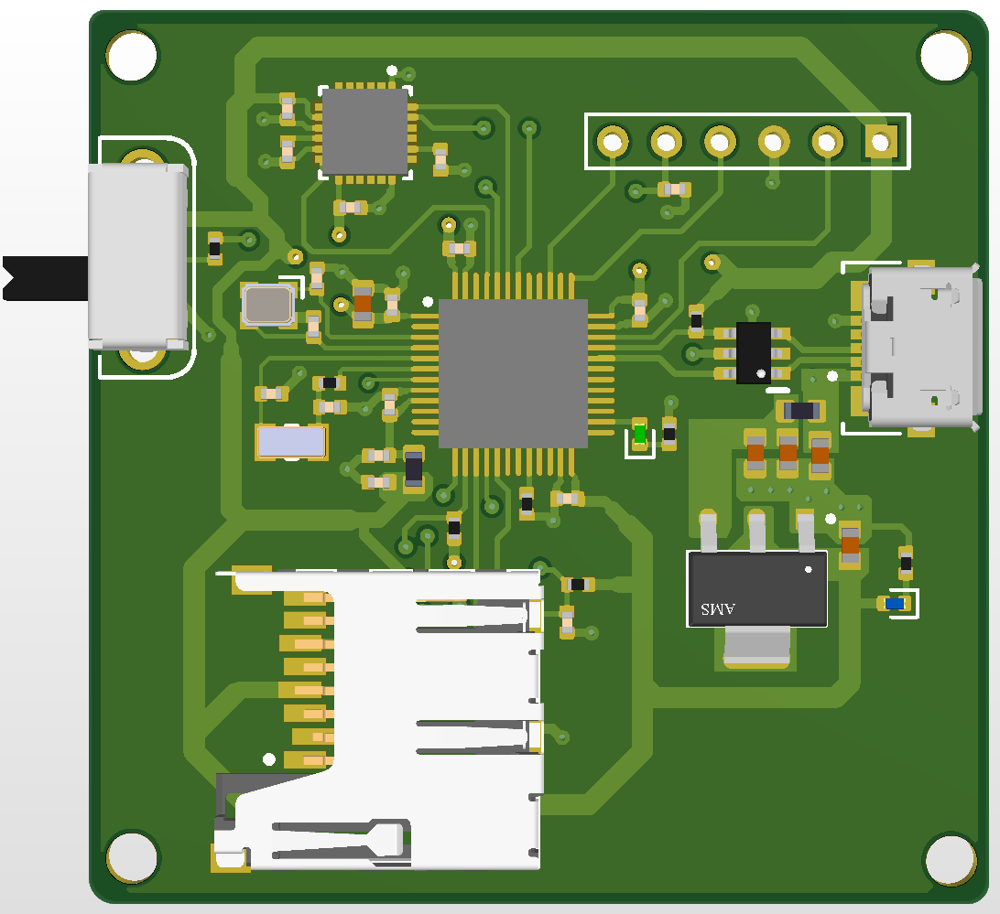

# STM32_DataLogger
Certainly! Here's the updated `README.md` for your STM32 Data Logger project, incorporating the reference to the schematic diagram PNG file from your repository:

---

# STM32 Data Logger

This repository contains the firmware and design files for a **data logger** based on the **STM32F103** microcontroller. The system is designed to collect sensor data over I2C and store it on a microSD card via SPI, allowing for long-term, timestamped environmental data logging. It’s ideal for applications like embedded monitoring, experiments, or remote sensing setups.

---

## 🧰 Features

- **Sensor Integration**  
  Currently supports:
  - MPU6050 (accelerometer + gyroscope) over I2C
  - Easily extensible for additional sensors

- **Data Logging to SD Card**
  - Collected sensor data is stored in CSV format
  - Files are created per session or by date/time
  - Uses SPI to interface with a microSD card module

- **Time-Stamping with RTC**
  - Built-in support for real-time clock (software RTC or external module like DS3231)
  - Logs are timestamped for proper chronological analysis

- **Low Power Ready**
  - Designed with power-efficient logging in mind (sleep modes can be added)

- **Modular Code**
  - HAL-based firmware (STM32Cube)
  - Easily portable to other STM32 MCUs

---

## 🖥️ Software Used

- **Altium Designer**  
  Used for schematic capture and PCB design of the custom STM32 data logger board.

- **STM32CubeIDE**  
  For writing, compiling, and flashing the firmware.

- **STM32CubeMX**  
  Used for initial code and peripheral configuration.

---

## 🚀 Getting Started

### Prerequisites

- STM32F103-based board (custom or Blue Pill)
- microSD card module (SPI)
- I2C sensor (e.g., MPU6050)
- USB to UART module (for serial debug/logging)

### Clone the Repository

```bash
git clone git@github.com:Shreyash-Tripathii/STM32_DataLogger.git
```

### Open in STM32CubeIDE

1. Launch STM32CubeIDE  
2. Import the project using `File > Open Projects from File System`  
3. Connect your STM32 board  
4. Build and flash the firmware

---

## 📊 Data Logging Details

- **Format**:  
  Sensor data is logged in CSV format for easy import into Excel or MATLAB.  
  Example log:
  ```
  Timestamp, AccX, AccY, AccZ, GyroX, GyroY, GyroZ
  2025-04-06 12:34:56, 123, 456, 789, 10, 11, 12
  ```

- **Storage**:
  - Data is written to an SD card mounted over SPI.
  - Filenames can be dynamic (`log_001.csv`, `log_002.csv`, etc.) or date-based (`2025_04_06.csv`).

- **Error Handling**:
  - Initializes SD card with feedback via UART.
  - If SD card is not present, logs can be redirected to UART or skipped.

---

## 🛠️ PCB Design

All schematic and layout files are made in **Altium Designer** and are available in the repo. Below is the schematic diagram of the data logger:



The board includes:
- STM32F103C8T6 microcontroller
- 3.3V LDO regulator
- microSD card slot
- I2C and UART headers
- RTC module header (optional)

---

## 🤝 Contributing

Want to improve this project?  
Feel free to fork the repo, raise issues, or create pull requests!

---
